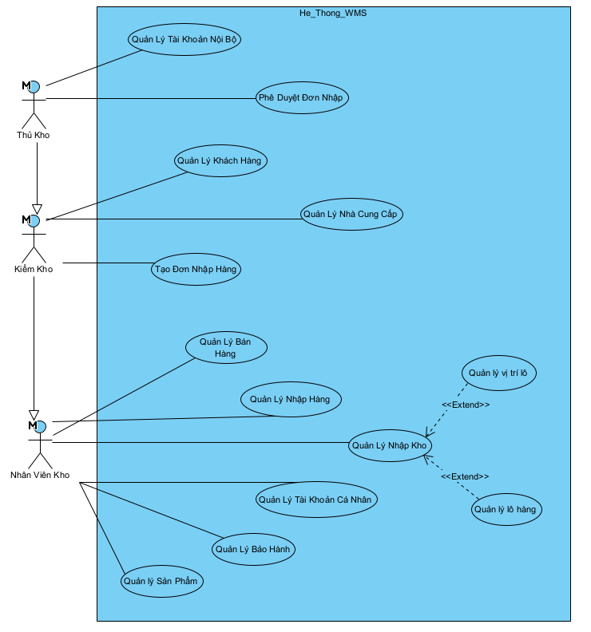

# SmartStock - Warehouse Management System (WMS)

## 📝 Giới thiệu dự án

SmartStock là hệ thống quản lý kho hàng được phát triển theo ý tưởng của một hệ thống ERP nhưng là ở quy mô bài tập lớn bậc đại học, có thể giúp trực quan hóa việc theo dõi hàng tồn kho và quản lý các luồng nghiệp vụ vận chuyển.

## 🛠 Công nghệ sử dụng

Dự án tập trung vào hiệu năng Backend và tính ứng dụng cao với các công nghệ:

- **Backend:** Java Spring Boot
- **Frontend:** HTML5, CSS3, JavaScript, Bootstrap (Focus vào tính năng, không qua UI/UX phức tạp)
- **Database:** MySQL
- **Công cụ thiết kế:** Visual Paradigm (ER Diagram, Use Case)

## 🚀 Tính năng chính

**🖼️ Sơ đồ Use Case Tổng quát** 

<p align="center">
  
  <br>
  <em>Hình 1: Sơ đồ chức năng hệ thống SmartStock</em>
</p>

## 📋 Hướng dẫn cài đặt

1.  **Yêu cầu hệ thống:** \* Java JDK 17+
    - Maven 3.6+
    - MySQL 8.0+
2.  **Cấu hình Database:**
    - Tạo database tên `smartstock_db` trong MySQL.
    - Cấu hình username/password trong file `src/main/resources/application.properties`.
3.  **Chạy ứng dụng:**
    ```bash
    mvn spring-boot:run
    ```

## 📂 Cấu trúc thư mục chính

- `src/main/java`: Chứa mã nguồn xử lý logic (Controller, Service, Repository).
- `src/main/resources`: Chứa file cấu hình và các tài nguyên giao diện (Static/Templates).
- `database/`: Chứa các bản vẽ ERD và script SQL khởi tạo.

## 📄 Tài liệu dự án

- [Tải về hoặc Xem báo cáo chi tiết (PDF)](database/Báo-cáo-phần-mềm-SmartSotck.pdf)
